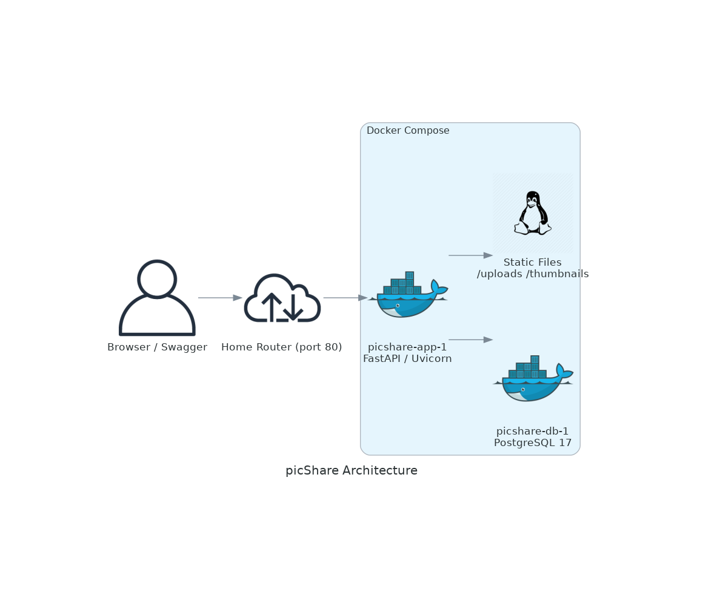
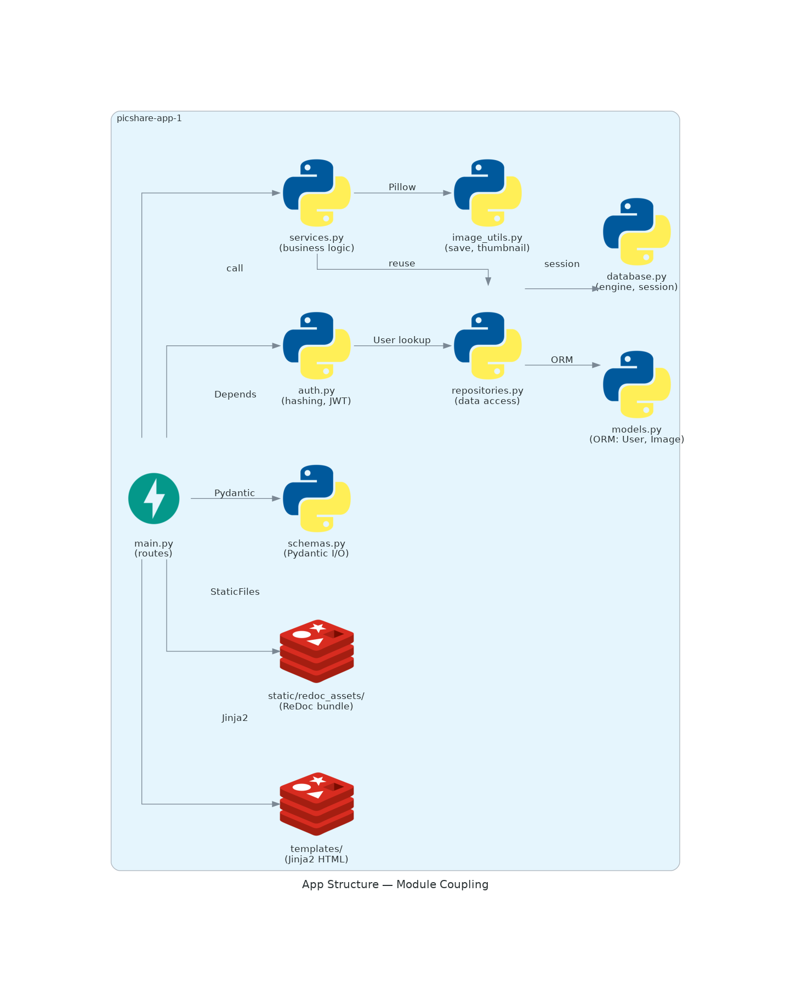

# Architecture

> Diagram generated from [`docs/diagram.py`](diagram.py) using the
> [Diagrams](https://diagrams.mingrammer.com/) library.
> Re-generate with: `python3 docs/diagram.py`

## App structure

| Module / Directory | Role |
|--------------------|------|
| `main.py` | Route definitions, app entry point |
| `services.py` | Business logic / domain rules (raises domain exceptions) |
| `repositories.py` | Data access layer (wraps SQLAlchemy per entity) |
| `models.py` | SQLAlchemy ORM models (`User`, `Image`) |
| `schemas.py` | Pydantic request/response validation |
| `auth.py` | Password hashing; JWT creation/verification; session-cookie helpers (`create_session_cookie`, `read_session_cookie`, `get_current_user_from_cookie`) |
| `database.py` | DB engine, session factory, settings |
| `image_utils.py` | File save, thumbnail generation |
| `templates/` | Jinja2 HTML templates (`base.html`, `home.html`, `login.html`, `register.html`) |
| `static/redoc_assets/` | Local ReDoc standalone bundle (no CDN) |

## Request flow

1. Request hits Uvicorn → FastAPI routes it to the matching handler
2. Dependencies run automatically — `get_db`, `get_current_user` (Bearer) for
   the JSON API, and `get_current_user_from_cookie` for the browser routes
3. Handler (`main.py`) delegates to a service in `services.py`
4. Service applies business rules, talking to the DB via a repository (`repositories.py`)
5. FastAPI converts the ORM result to a Pydantic schema (validation)
6. JSON response is sent back

## Auth flow

There are two authentication paths, shared via the same signing key:

**JSON API (Bearer token).** Requests carry `Authorization: Bearer <jwt>`.
`Depends(get_current_user)` decodes the JWT and rejects with `401` if invalid.

**Browser (session cookie).** The `picshare_session` cookie holds the same
signed JWT. It is set as `HttpOnly` + `SameSite=lax` on register/login form
success and cleared on logout. Browser routes read it via
`Depends(get_current_user_from_cookie)`, which returns the `User` or `None`
(never raises) so pages can render logged-in vs logged-out state.

Registration requires an `invite_code` field when the environment variable
`PICSHARE_INVITE_CODE` is set. If unset, registration is open to anyone.

- `POST /register` — validate invite code (if configured) → hash password with bcrypt → store user → return JWT
- `POST /login` — verify password → return JWT
- `POST /register/form` — same, but sets the session cookie (auto-login) and redirects home
- `POST /login/form` — same, but sets the session cookie and redirects home
- `POST /logout` — clears the session cookie and redirects home
- Protected JSON endpoints use `Depends(get_current_user)` which decodes the
  JWT from the `Authorization: Bearer <token>` header

## Image storage

Uploaded images and thumbnails are stored on disk under `app/static/`. The
FastAPI app serves them via `StaticFiles` mounts at `/uploads` and
`/thumbnails`. The directory is bind-mounted from the host in
`docker-compose.yml`, so files persist across container restarts.